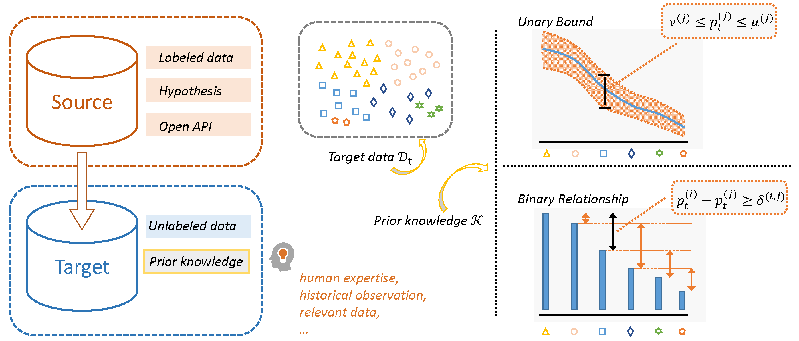
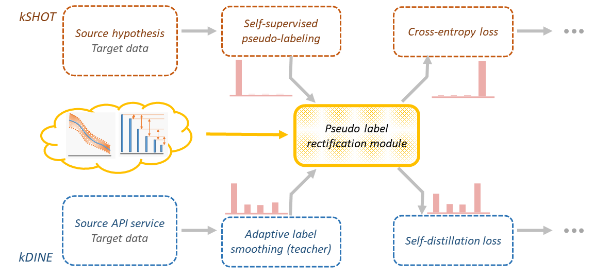

# KUDA
Pytorch implementation of KUDA. 
> [Prior Knowledge Guided Unsupervised Domain Adaptation](https://arxiv.org/abs/2207.08877)                 
> Tao Sun, Cheng Lu, and Haibin Ling                 
> *ECCV 2022* 

## Abstract
The waive of labels in the target domain makes Unsupervised Domain Adaptation (UDA) an attractive technique in many real-world applications, though it also brings great challenges as model adaptation becomes harder without labeled target data. In this paper, we address this issue by seeking compensation from target domain prior knowledge, which is often (partially) available in practice, e.g., from human expertise. This leads to a novel yet practical setting where in addition to the training data, some prior knowledge about the target class distribution are available. We term the setting as Knowledge-guided Unsupervised Domain Adaptation (KUDA). In particular, we consider two specific types of prior knowledge about the class distribution in the target domain: Unary Bound that describes the lower and upper bounds of individual class probabilities, and Binary Relationship that describes the relations between two class probabilities. We propose a general rectification module that uses such prior knowledge to refine model generated pseudo labels. The module is formulated as a Zero-One Programming problem derived from the prior knowledge and a smooth regularizer. It can be easily plugged into self-training based UDA methods, and we combine it with two state-of-the-art methods, SHOT and DINE. Empirical results on four benchmarks confirm that the rectification module clearly improves the quality of pseudo labels, which in turn benefits the self-training stage. With the guidance from prior knowledge, the performances of both methods are substantially boosted. We expect our work to inspire further investigations in integrating prior knowledge in UDA.

### Knowledge-guided Unsupervised Domain Adaptation (KUDA)


### Integrating rectification module into SHOT and DINE


## Usage
### Prerequisites

We experimented with python==3.8, pytorch==1.8.0, cudatoolkit==11.1, gurobi==9.5.0.

For Zero-One programming, we use [Gurobi Optimizer](https://www.gurobi.com/). A free [academic license](https://www.gurobi.com/academia/academic-program-and-licenses/) can be obtained from its official website. 


### Data Preparation
Download the [office31](https://faculty.cc.gatech.edu/~judy/domainadapt/), [Office-Home](https://www.hemanthdv.org/officeHomeDataset.html), [VisDA](https://ai.bu.edu/visda-2017/), [DomainNet](http://ai.bu.edu/M3SDA/) datasets.

Setup dataset path in ./data
```shell
bash setup_data_path.sh /Path_to_data/office/domain_adaptation_images office31
bash setup_data_path.sh /Path_to_data/office-home/images office-home
bash setup_data_path.sh /Path_to_data/office-home/images office-home-rsut
bash setup_data_path.sh /Path_to_data/VisDA visda
bash setup_data_path.sh /Path_to_data/DomainNet domainnet40
```

### kSHOT
Unsupervised Closed-set Domain Adaptation (UDA) on the Office-Home dataset 
```shell
cd SHOT

time=`python ../util/get_time.py`
gpu_id=0

# generate source models
for src in "Product" "Clipart" "Art" "Real_World"; do
    echo $src
    python image_source.py --trte val --da uda --gpu_id $gpu_id --dset office-home --max_epoch 50 --s $src --timestamp $time
done

# adapt to other target domains with Unary Bound prior knowledge
for seed in 2020 2021 2022; do
    for src in "Product" "Clipart" "Art" "Real_World"; do
        echo $src
        python image_target_kSHOT.py --cls_par 0.3 --da uda --gpu_id $gpu_id --dset office-home --s $src --timestamp $time --pk_uconf 0.0 --seed $seed --pk_type ub
    done
done
```

### kDINE
Unsupervised Closed-set Domain Adaptation (UDA) on the Office-Home dataset 
```shell
cd DINE

time=`python ./get_time.py`
gpu=0

for seed in 2020 2021 2022; do
for src in 'Product' 'Real_World' 'Art' 'Clipart' ; do
      echo $src
      # training the source model first
      python DINE_dist.py --gpu_id $gpu --seed $seed --dset office-home --s $src --da uda --net_src resnet50 --max_epoch 50 --timestamp $time
      # the first step (Distill) with Unary Bound prior knowledge
      python DINE_dist_kDINE.py --gpu_id $gpu --seed $seed  --dset office-home --s $src --da uda --net_src resnet50 --max_epoch 30 --net resnet50  --distill --topk 1 --timestamp $time --pk_type ub --pk_uconf 0.0
      # the second step (Finetune)
      python DINE_ft.py --gpu_id $gpu --seed $seed --dset office-home --s $src --da uda --net_src resnet50 --max_epoch 30 --net resnet50 --lr 1e-2  --timestamp $time --method kdine
done
done
```
Complete commands are available in ./SHOT/run_all_kSHOT.sh and ./DINE/run_all_kDINE.sh.

## Acknowledgements
The implementations are adapted from [SHOT](https://github.com/tim-learn/SHOT) and 
  [DINE](https://github.com/tim-learn/DINE).
  
  
## Citation
If you find our paper and code useful for your research, please consider citing
```bibtex
@inproceedings{sun2022prior,
    author    = {Sun, Tao and Lu, Cheng and Ling, Haibin},
    title     = {Prior Knowledge Guided Unsupervised Domain Adaptation},
    booktitle = {Proceedings of the European Conference on Computer Vision (ECCV)},
    year      = {2022}
}
```